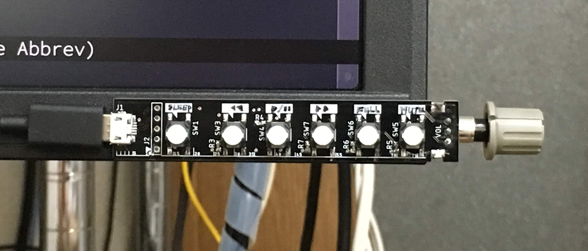
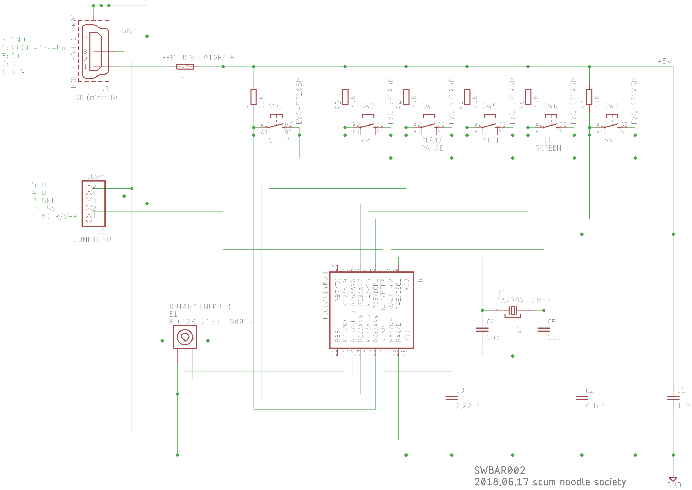
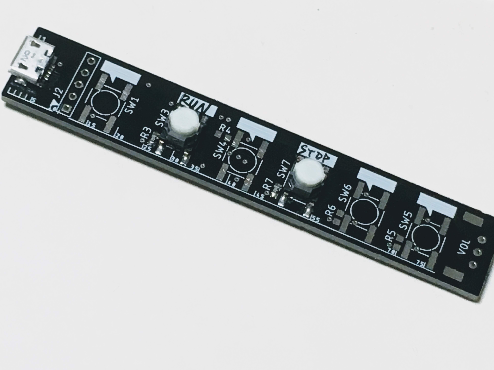

# pic_usb_media_key

- IDE: MPLAB X v4.15
- compiler: C18 v3.46

## variant

### branch: hp_dso_pad

A quickfix for `RUN` and `STOP` buttons for DSOs [Agilent MSO8064A](https://www.keysight.com/en/pd-718231-pn-MSO8064A/infiniium-mixed-signal-oscilloscope-600-mhz-4-scope-and-16-digital-channels/).

## reference design

- [AE-PIC18F14K50](http://akizukidenshi.com/download/ds/akizuki/AE-PIC18F14K50.pdf)

